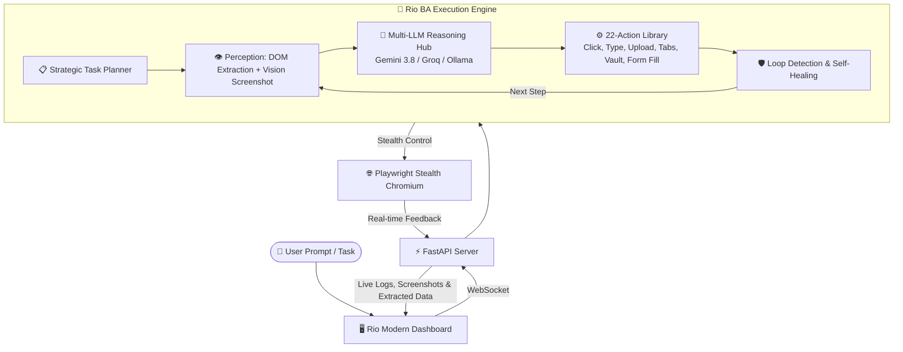

<div align="center">

<!-- ═══════════════════ ANIMATED CAPSULE HEADER ═══════════════════ -->


<!-- ═══════════════════ ANIMATED TYPING SUBTITLE ═══════════════════ -->
<a href="https://github.com/Yahia-Elhamzawy/RioBA">
  
</a>

<p align="center">
  <strong>An Intelligent, Autonomous Web AI Agent that browses, automates, interacts, and extracts data with human-like stealth.</strong>
</p>

<!-- ═══════════════════ BADGES ═══════════════════ -->
<p align="center">
  
  
  
  
  
  
</p>

<!-- ═══════════════════ REPO STATS BADGES ═══════════════════ -->
<p align="center">
  
  
  
  
</p>

<p align="center">
  <a href="#-interactive-demo">Demo</a> •
  <a href="#-key-features">Features</a> •
  <a href="#-architecture">Architecture</a> •
  <a href="#-quick-start">Quick Start</a> •
  <a href="#-configuration--api-keys">API Keys</a> •
  <a href="#-troubleshooting">FAQ</a>
</p>

<!-- ═══════════════════ GLOWING DIVIDER ═══════════════════ -->


</div>

## 📺 Interactive Live Terminal Demo

<div align="center">
  
</div>

---

## 🌟 Overview

**Rio BA** is an advanced autonomous web agent built with Python, FastAPI, and Playwright. Unlike traditional scrapers or rigid bots, Rio perceives the web page dynamically using **Vision + DOM hybrid perception**, reasons through tasks via state-of-the-art LLMs (Gemini 3.8 Flash, Groq Llama 3.3, OpenRouter, or Local Ollama), and executes complex workflows while completely evading bot detection.

Whether automating job applications, managing social media, extracting competitive intelligence, or running multi-step QA audits, **Rio BA** handles it end-to-end.

---

## 🚀 Key Features

<table>
  <tr>
    <td width="50%">
      <h3>👁️ Vision & Hybrid Perception</h3>
      Combines real-time DOM element trees with automatic screenshot checkpoints to perceive dynamic JavaScript SPAs, popups, and canvas elements accurately.
    </td>
    <td width="50%">
      <h3>🛡️ Stealth Anti-Detection Engine</h3>
      Bypasses Cloudflare, DataDome, and anti-automation filters by patching <code>navigator.webdriver</code>, injecting realistic chrome plugins, and mimicking human behavior.
    </td>
  </tr>
  <tr>
    <td width="50%">
      <h3>⚡ Multi-LLM Smart Router</h3>
      Switch on-the-fly between <b>Gemini 3.8 Flash</b> (ultra-fast multimodal), <b>Groq Llama 3.3 70B</b> (low latency), <b>OpenRouter</b>, or <b>Ollama</b> (100% offline & local).
    </td>
    <td width="50%">
      <h3>🔐 Account Vault & Session State</h3>
      Stores encrypted user credentials in a local Vault and retains browser sessions, cookies, and local storage across tasks without repetitive logins.
    </td>
  </tr>
  <tr>
    <td width="50%">
      <h3>🔄 Loop Detection & Auto-Recovery</h3>
      Monitors repetitive action loops and automatically breaks out, scrolls, adjusts element selectors, or prompts for human intervention when required.
    </td>
    <td width="50%">
      <h3>💻 Script & Data Auto-Export</h3>
      Every finished workflow automatically generates a standalone, reproducible <b>Playwright Python script</b> and exports structured JSON data.
    </td>
  </tr>
</table>

---

## 🧠 Architecture & Agent Workflow



---

## 🛠️ Quick Start

### 1. Prerequisites
- **Python 3.10+** (Python 3.11, 3.12, or 3.13 supported)
- **Git**

### 2. Clone the Repository
```bash
git clone https://github.com/Yahia-Elhamzawy/RioBA.git
cd RioBA
```

### 3. Install Dependencies
```bash
pip install -r requirements.txt
```

### 4. Install Playwright Browsers *(Crucial Step)*
Download the required Chromium and Chrome Headless binaries:
```bash
playwright install chromium
```

### 5. Setup Environment Variables
Copy the template configuration file:
```bash
# On Windows (cmd):
copy examEvn .env

# On Linux / macOS / PowerShell:
cp examEvn .env
```
Now open `.env` and insert your API keys (see instructions below).

### 6. Launch Rio BA
- **Windows (Double Click or Terminal):**
  ```bat
  run.bat
  ```
- **Direct Python Command:**
  ```bash
  python server.py
  ```

Your browser will automatically open: **`http://localhost:8000`** 🎉

---

## 🔑 Configuration & API Keys

Rio BA supports multiple AI providers. All keys must be placed inside your local `.env` file. A ready-to-use template is provided in **`examEvn`**.

> [!IMPORTANT]
> **Security Notice:** The `.env` file contains your private API credentials and is excluded by `.gitignore`. **NEVER share or commit your `.env` file to any public repository!**

### Available Providers in `examEvn`:

```env
# ── 1. Google Gemini (Recommended & Default: Gemini 3.8 Flash) ──────
# Free key: https://aistudio.google.com/app/apikey
GEMINI_API_KEY=your_gemini_api_key_here

# ── 2. Groq Cloud (Ultra-Fast Llama 3.3 70B) ────────────────────────
# Free key: https://console.groq.com/keys
GROQ_API_KEY_1=gsk_your_primary_groq_api_key
GROQ_API_KEY_2=gsk_your_backup_groq_api_key

# ── 3. OpenRouter (Access to 200+ models) ───────────────────────────
# Key: https://openrouter.ai/keys
OPENROUTER_API_KEY=sk-or-v1-your_openrouter_api_key

# ── 4. Ollama (100% Free & Local Offline Inference) ────────────────
# Set to 'localhost' or your local LAN IP (e.g., 192.168.1.50)
OLLAMA_HOST=localhost
```

---

## 📁 Project Structure

```text
RioBA/
├── 📄 server.py              # Main FastAPI server, WebSocket hub & Agent Loop
├── 📄 agent.py               # Standalone agent runner script
├── 📄 examEvn                # Clean template for your .env API configuration
├── 📄 requirements.txt       # Python dependencies list
├── 📄 run.bat                # 1-Click launcher for Windows
├── 📄 .gitignore             # Shields .env, vault, and user browser data
├── 📁 assets/                # Animated SVGs, diagrams and visual branding
│   └── 📄 demo-terminal.svg  # Animated interactive terminal graphic
├── 📁 static/                # Dashboard interface (HTML5, Modern CSS, JS)
│   ├── 📄 index.html         # Agent Control Center & Chat UI
│   ├── 📄 style.css          # Dark neon glassmorphic styling
│   └── 📄 app.js             # WebSocket handler & UI logic
├── 📁 browser_data/          # Persistent user profile & active sessions (ignored)
├── 📁 extracted_data/        # JSON exports of structured data (ignored)
└── 📁 videos/                # Recorded session screen captures (ignored)
```

---

## 🧰 Troubleshooting & FAQ

<details>
<summary><b>❌ Error: Executable doesn't exist at ms-playwright\...</b></summary>
<br>
This happens when Playwright's browser binaries haven't been downloaded yet. Run:
```bash
playwright install chromium
```
</details>

<details>
<summary><b>❌ Error: [WinError 10048] address already in use ('127.0.0.1', 8000)</b></summary>
<br>
Another instance of the server is still running on port 8000. Close any previous Python processes in Task Manager, or run:
```powershell
Get-Process | Where-Object { $_.ProcessName -like "*python*" } | Stop-Process -Force
```
</details>

<details>
<summary><b>❌ UnicodeEncodeError: 'charmap' codec can't encode character</b></summary>
<br>
Windows Arabic / regional console defaults can struggle with UTF-8 emojis. Rio BA automatically sets <code>sys.stdout.reconfigure(encoding='utf-8')</code>. If running manually, set:
```cmd
chcp 65001
set PYTHONIOENCODING=utf-8
```
</details>

---

## 🤝 Contributing

Contributions, issues, and feature requests are welcome!
Feel free to check the [issues page](https://github.com/Yahia-Elhamzawy/RioBA/issues).

1. Fork the Project
2. Create your Feature Branch (`git checkout -b feature/AmazingFeature`)
3. Commit your Changes (`git commit -m 'Add some AmazingFeature'`)
4. Push to the Branch (`git push origin feature/AmazingFeature`)
5. Open a Pull Request

---

## 📜 License & Credits

Distributed under the **MIT License**. See `LICENSE` for more information.

- **Author:** [Yahia Elhamzawy](https://github.com/Yahia-Elhamzawy)
- **Repository:** [https://github.com/Yahia-Elhamzawy/RioBA.git](https://github.com/Yahia-Elhamzawy/RioBA.git)

<!-- ═══════════════════ ANIMATED CAPSULE FOOTER ═══════════════════ -->
<div align="center">
  
  <br/>
  <sub>Built with ❤️ for the open-source web automation community.</sub>
</div>
